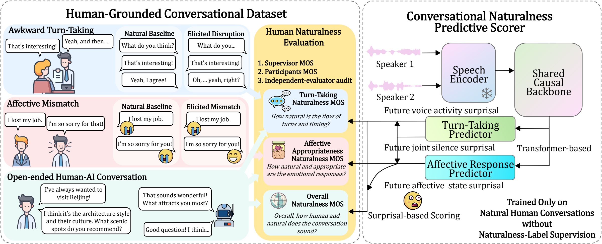

# CONTACT

Code for **CONTACT: A Human-Grounded Benchmark and Surprisal-Based Predictive
Scorer for Conversational Naturalness**.



This release includes audio preprocessing, checkpoint inference, and evaluation.
Model weights and audio are downloaded separately. The recording scores and
ratings used in the evaluation tables are included in `data/`.

## Installation

Use Python 3.10 and run commands from this directory.

```bash
python -m venv .venv
source .venv/bin/activate
python -m pip install -r requirements.txt
```

This installs the package with audio, inference and test dependencies.
Audio preprocessing requires a CUDA GPU for the affect teacher. If you only
need to reproduce tables from the included scores, use the smaller CPU install:

```bash
python -m pip install -c constraints.txt -e '.[test]'
```

## Reproduce the tables

```bash
OPENBLAS_NUM_THREADS=1 OMP_NUM_THREADS=1 \
python -m contact.evaluate --data data --output outputs/evaluation
```

This reads the included recording scores; it does not run the neural models.
Outputs are `metrics.csv` (dev/test/all), `components.csv`, `table.tex`, and
`run.json`. The LaTeX table uses `booktabs` and `graphicx`.

To include paired session-bootstrap comparisons:

```bash
OPENBLAS_NUM_THREADS=1 OMP_NUM_THREADS=1 \
python -m contact.evaluate --data data --output outputs/bootstrap \
  --bootstrap 20000 --seed 20260925
```

Bootstrap outputs contain paired differences, 95% confidence intervals and
unadjusted two-sided p-values. Comparisons use the strongest observed baseline
at each endpoint on the retrospective evaluation split.

## Score audio

Place downloaded audio in `datasets/`. See [datasets/README.md](datasets/README.md)
for the three CONTACT subsets, the Seamless Interaction data source, and
batch scoring commands. Scoring new audio does not require MOS labels.

### Weights

Download [contact.zip](https://github.com/review-anonymous-git/contact-code/releases/download/v1.0/contact.zip)
from the [v1.0 release](https://github.com/review-anonymous-git/contact-code/releases/tag/v1.0).
Extract the archive and place `contact.pt` at `checkpoints/contact.pt`, then
verify the extracted model:

```bash
python -m contact.checkpoint --checkpoint checkpoints/contact.pt
```

File sizes and SHA-256 checksums for the model and ZIP archive are listed in
[checkpoints/manifest.json](checkpoints/manifest.json).
Weights and generated caches are excluded from Git. The checkpoint contains
the predictor's inference parameters.

### Audio preparation

Install the affect-teacher wrapper at the following revision:

```bash
git clone https://github.com/tiantiaf0627/vox-profile-release.git third_party/vox-profile-release
git -C third_party/vox-profile-release checkout 85100e60844a3f324a139e24fb9225aa6d8e45d1
```

Use a stereo WAV with one speaker per channel, or two aligned mono tracks.
Do not duplicate a mixed signal into both channels.

```bash
python -m contact.prepare \
  --tracks /path/to/speaker_a.wav /path/to/speaker_b.wav \
  --recording-id example --output cache/example --device cuda:0

python -m contact.infer \
  --cache cache/example --corpus hai \
  --device cuda:0 --output outputs/example.csv
```

For stereo audio, replace `--tracks ... ...` with `--audio /path/to/stereo.wav`.
Corpus choices are `hh_turn`, `hh_emotion`, and `hai`; they select the stored
development-set normalization statistics. Scores are relative naturalness
scores (higher is better), **not calibrated 1–5 MOS predictions**.

Preparation downloads pinned Mimi and dimensional-affect checkpoints from
Hugging Face. Add `--local-files-only` and set `HF_HUB_OFFLINE=1` when all models
are already cached. Third-party models retain their own licenses.

For multiple prepared recordings, pass `--manifest recordings.csv` instead of
`--cache` and `--corpus`:

```csv
recording_id,corpus,cache_dir
example,hai,cache/example
```

Cache paths are relative to the manifest. Each cache contains two Mimi feature
arrays, VAD, affect targets and a checksum manifest. Preparation refuses to
overwrite an existing cache. Inference works on CPU as well, but is slower.

VAD, future-activity, silence and soft A/V targets are described in
[docs/preprocessing.md](docs/preprocessing.md).

If an inference CSV covers all 493 released recording IDs, evaluate it with
`python -m contact.evaluate --predictions outputs/predictions.csv --output outputs/rescored`.
This retains the released labels, split, baseline scores and dev normalization.

### Scoring

Inference uses 20-second windows with 8-second overlap, 3 seconds of left
context and a 2-second future guard. Overlapping scoring regions are assigned
to the first eligible window. The final checkpoint has separate timing and
affective Transformers and three readouts:

- **F:** negative mean future-activity NLL over valid frames.
- **S:** negative mean future joint-silence NLL. The target is the proportion
  of the next 4 seconds in which neither speaker talks, quantized into 10 bins.
- **A:** negative absolute difference between speakers' mean affective
  predictive gains. Gains compare the predicted likelihood with a training
  prior, averaged within each response and then across responses.

The affect head predicts separate eight-bin arousal and valence distributions
for each speaker. Targets come from response-aligned 3-second windows with a
1-second hop, at least 1.5 seconds of audio and 60% VAD activity. Both speakers
contribute to A, including in H–AI conversations. Future observations are used
as scoring targets, not as inputs to the causal predictor.

After subset-specific dev standardization:

```text
Timing  = 0.45 F + 0.55 S
Affect  = 0.25 A + 0.75 S
Overall = 0.50 Timing + 0.50 Affect
```

The formulas are in [contact/readout.py](contact/readout.py), the architecture
in [contact/model.py](contact/model.py), and the fixed settings in
[configs/scoring.json](configs/scoring.json). Affective and overall scores are
not reported for the H–H timing subset. Component ablations remove scores from
this same checkpoint; they are not separately retrained models.

## Evaluation data

| Subset | Dev | Test | Total |
| --- | ---: | ---: | ---: |
| H–H turn-taking | 60 | 120 | 180 |
| H–H affective mismatch | 32 | 68 | 100 |
| H–AI | 70 | 143 | 213 |

[data/splits.csv](data/splits.csv) records sessions, pseudonymous speaker IDs
and conditions. Human speakers are disjoint across dev/test, including across
subsets. The evaluator checks IDs, checksums and speaker disjointness.

`ratings.csv` contains Participant (P), Supervisor (S), and Combined (C) MOS,
where `C = (P + S) / 2`. Rating definitions are recorded in
[data/release.json](data/release.json).

Paired accuracy compares manipulated recordings with the natural recording
from the same session. C-index compares all natural–manipulated pairs within
the subset and split. Both give half credit for ties. MOS alignment uses
recording-level Spearman correlation.

Seven baseline score sets are included. Their recording-level adaptations are
described in [docs/baselines.md](docs/baselines.md); baseline inference pipelines
are not bundled. Audio examples are hosted separately at
[contact-samples](https://github.com/review-anonymous-git/contact-samples).

## Tests

```bash
python -m pytest -q
```

Tests requiring PyTorch or Transformers are skipped when those optional
dependencies are absent. No test downloads a model or requires a GPU.
